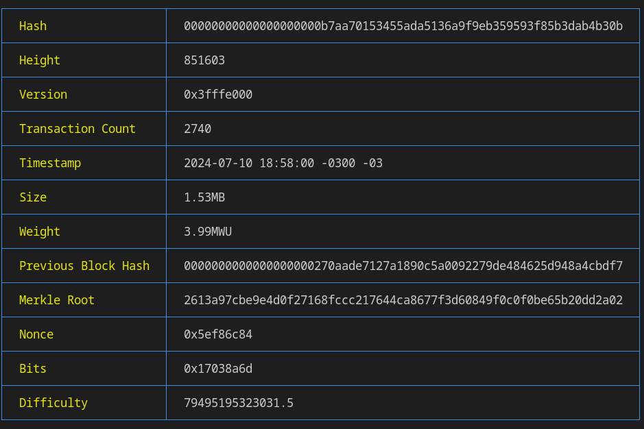

# Tuxbit

Command-line interface to explore the Bitcoin ecosystem.



## Usage

```shell
usage: tuxbit [-a ADDRESS [-t]] [-b HASH/HEIGHT] [-bl] [-d] [-f] [-h] [-tx TXID [-v]] [--version]

Command-line interface to explore the Bitcoin ecosystem.
--------------------------------------------------------------------------
https://gitlab.com/sinkibrant/tuxbit

optional arguments:

 -a, --address HASH_ADDRESS      Return information about a Bitcoin address
    -t, --transactions             Return the latest 50 transactions associated with the address

 -b,  --block HASH/HEIGHT        Return information about a block using its hash or height

 -bl, --block-latest             Return information about the latest block

 -d, --difficulty                Return information about the network difficulty adjustment

 -f, --fee                       Return the currently suggested transaction fees

 -h,  --help                     Show this help message and exit

 -tx HASH_TRANSACTION            Return simplified information about a transaction
    -v, --verbose                  Return detailed information about the associated transaction

 --version                       Show the version number and exit
```

## Installation

### Simple Installation

Install the latest stable version [here](https://gitlab.com/-/project/59783113/uploads/d07c75520cdb85e4dbadb63a584e7527/tuxbit) and follow these steps:

Navigate to the directory where the binary was installed and move it to /usr/local/bin/
```shell
sudo mv tuxbit /usr/local/bin/
```

---
Ensure the tuxbit binary can be executed
```shell
sudo chmod +x /usr/local/bin/tuxbit
```
---
Verify installation by running the binary with the help flag; if a message appears, it indicates success:
```shell
tuxbit -h
```
---

### Advanced Installation
If you prefer to download manually and compile on your machine, follow these steps:

+ Ensure [Golang](https://go.dev/) is installed on your machine.
+ Download the source code from [Gitlab](https://gitlab.com/sinkibrant/tuxbit/-/releases) or execute:
```shell
git clone https://gitlab.com/sinkibrant/tuxbit.git
```
+ With Golang installed, navigate to the downloaded files and execute:
```shell
go build .
```
+ Now that the binary is ready, follow the steps outlined in "Simple Installation" for configuration.

## Contributing

Pull requests are welcome. For major changes, please open an issue first
to discuss what you would like to change.

## License

[Unlicense](https://unlicense.org/)